# Seekwd / Pong Harness 系统拆分与流程模型

> 文档类型：System Decomposition / Business Process / Data Flow / State Transition Model  
> 文档状态：Experimental Proposal  
> 最后更新：2026-09-20  
> 规范边界：本文用于产品、模块和流程拆解；身份、状态、命令、事件、权限和恢复字段以 [27-normative-contracts](27-normative-contracts/00-README.md) 为准。

## 1. 为什么不能只使用增删改查

CRUD 只能描述对象的基本生命周期，不能覆盖 Agent 工作台的核心风险和业务闭环。Seekwd 至少需要以下行为类别：

| 行为类别 | 含义 | 示例 |
|---|---|---|
| Create | 创建可变对象、不可变版本或请求 | 创建 Workspace、Draft、Revision、Run、ApprovalRequest |
| Read | 查询、搜索、比较、追踪和订阅 | 查看 Run、比较 Revision、追踪 Lineage、订阅事件 |
| Update | 修改可变配置或追加新版本 | 编辑 Draft、修改 Automation、轮换 Secret |
| Delete | 删除、归档、撤回、吊销和垃圾回收 | 归档 Canvas、撤回 Release、吊销 Grant、清理临时 Artifact |
| Execute | 启动实际工作 | 启动 Run、执行 NodeAttempt、运行 Automation |
| Control | 控制正在进行的工作 | 暂停、恢复、取消、接管、设置断点、调整优先级 |
| Validate | 检查结构、类型、权限和可运行性 | Graph Validation、Schema Validation、Release Preflight |
| Approve | 对高风险动作作出人类决策 | 批准网络、预算、数据导出、跨 Workspace 调用 |
| Observe | 实时观察和解释 | Run Monitor、日志、状态原因、成本、进度、数据流 |
| Debug | 定位并复现问题 | 断点、输入覆盖、单节点重试、RunBranch、回放 |
| Reconcile | 对账外部动作的真实结果 | SSH 失联、浏览器点击结果未知、远程 API 响应丢失 |
| Recover | 从崩溃、断线和不一致中恢复 | Cursor 重放、Snapshot 重同步、Handle 恢复、Backup Restore |
| Compensate | 通过反向或前向动作修复副作用 | 删除重复资源、恢复旧配置、执行补偿 Canvas |
| Schedule | 定时、事件和条件触发 | Cron、Webhook、文件变化、父 Canvas 调用 |
| Import/Export | 数据进入和离开系统 | 导入 Canvas、导出 Artifact、生成 Support Bundle |
| Notify/Attend | 主动提醒并形成待处理事项 | Notification、Approval、Wait、Recovery、Budget Alert |
| Audit | 保存不可篡改的主体、原因和证据 | Command/Event、Policy Decision、Approval、Export Audit |
| Govern | 管理合同、版本、扩展、保留和开放边界 | NodeDefinition 发布、Extension 权限、Retention、Migration |

因此每个模块不能只写“增删改查”，还必须回答：

1. 谁可以发起？
2. 发起的是意图、请求还是已经发生的事实？
3. 是否需要验证、权限评估或人工审批？
4. 是否会产生外部副作用？
5. 是否可以暂停、取消、重试或恢复？
6. 结果未知时由谁对账？
7. 产生哪些 Artifact、Evidence、Lineage 和 Audit？
8. UI 如何区分 pending、accepted、running、waiting、terminal 和 uncertain？

## 2. 系统上下文与边界

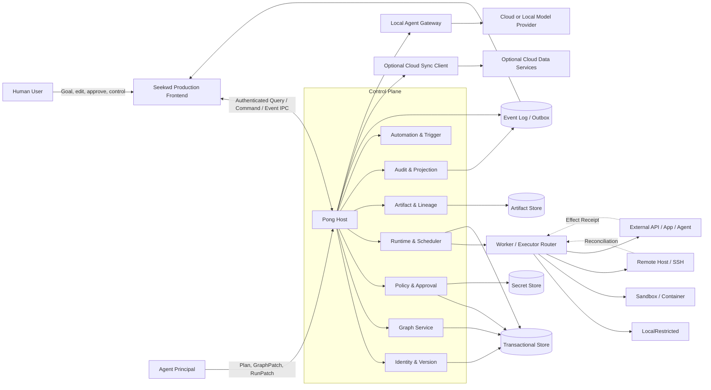

云端同步是旁路能力：本地 Host 先形成事实和加密 Sync Outbox，再由同步客户端上传允许的数据。云端不能直接连接 Worker、Executor、Secret Store 或 Runtime 写接口；云端返回内容必须经过本地版本、Digest、权限和冲突校验后才能进入本地 Draft 或 Projection。

云端模型调用走另一条受控链路：`pong-agent` 只发送经过数据边界过滤的 `ContextPacket`，模型只能返回结构化 `PlanProposal`、`GraphPatchProposal`、`RunPatchProposal` 或 `CommandRequest`；本地 `Agent Gateway`、Graph Service、Policy Service 和 Runtime 决定是否应用或执行。模型可以参与本地任务循环，但不直接持有本机 Worker、文件系统或 ExecutionHandle。

### 2.1 代码仓库中的物理落点

正式后端建立在仓库根目录的 Rust Workspace `crates/` 中，不建立在 `apps/workbench` 内，也不让 React 前端直接访问 SQLite、文件系统或 Worker。目标目录如下：

```text
D:/bs/seekwd/
  Cargo.toml                    Rust workspace 定义
  apps/
    ui-lab/                     UI 原型
    workbench/                  正式 React 前端
      src-tauri/                可选的薄桌面壳、窗口和 IPC 桥接
  crates/
    pong-host/                  后端进程入口、依赖注入、IPC、会话、迁移和生命周期
    pong-core/                  领域值对象、命令、事件、错误和服务接口
    pong-runtime/               Run、NodeRun、调度、等待、取消、恢复和跨 Canvas
    pong-policy/                Authority、Policy、Approval、Grant、Budget 和 Secret 引用
    pong-artifact/              Artifact、Evidence、Value、Lineage、内容寻址和保留
    pong-agent/                 Goal、Plan、Agent 协议、GraphPatch/RunPatch 提案
    pong-extension/             Extension、Manifest、NodeDefinition 和 Capability 生命周期
    pong-worker/                Worker 协议、心跳、流、取消、资源限制和结果收集
    pong-storage-sqlite/        SQLite、Event Store、Outbox/Inbox 和 Projection Adapter
    pong-executor-local/        LocalRestricted 执行器
    pong-protocol/              Rust 侧生成的 IPC/Command/Event Schema
  packages/
    seekwd-ui/                  UI 组件库
    seekwd-client/              TypeScript HostClient 和生成类型
    graph-schema/               Graph/Port 传输 Schema
    protocol-schema/            Command/Event/Error 传输 Schema
    node-sdk/                   扩展开发 SDK
    test-fixtures/              跨语言合同样本
  migrations/
    sqlite/                     有序、幂等、可校验的迁移
  extensions/
    standard-nodes/             标准节点实现和 Manifest
  tests/
    contract/                   Rust/TypeScript/SQLite/IPC 合同测试
    property/                   图、状态机和幂等属性测试
    fault/                      崩溃、断线、乱序、丢响应和恢复测试
    e2e/                        Workbench + Host + Worker 端到端测试
```

`apps/workbench/src-tauri` 若存在，只负责启动/连接 `pong-host`、窗口、系统通知、文件选择和受控 IPC 桥接；所有 Goal、Canvas、Run、Policy、Artifact、Agent 和 Worker 语义仍在 `crates/`。如果后续采用独立后台 Host 进程，Tauri 壳连接该进程；如果首版采用嵌入式 Host，Tauri 二进制依赖 `pong-host` crate，但业务代码位置仍不改变。

### 2.2 后端进程与调用边界

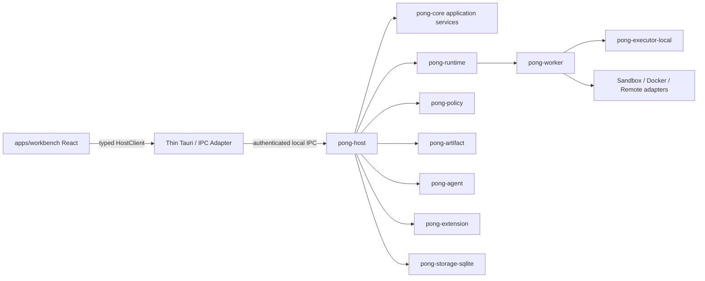

依赖只能朝合同和领域内核方向流动：Host 组合服务；Runtime 通过 trait 使用 Policy、Artifact 和 Executor；Storage 实现 Core 定义的存储接口；Worker 不导入 UI，也不拥有 Canvas 或 Goal 事实。

### 2.3 六个系统平面

| 平面 | 核心职责 | 主要模块 | 禁止承担 |
|---|---|---|---|
| Experience Plane | 用户操作、观察、编辑和决策 | Production Frontend、UI Library、Desktop Shell | 不拥有领域事实，不直接执行外部动作 |
| Control Plane | 身份、版本、命令、策略和调度协调 | Host、Graph、Policy、Runtime、Automation | 不把 UI local state 当事实 |
| Execution Plane | 实际运行受控动作 | Worker、Executor、ExecutionContext、Capability | 不自行扩大权限或修改 Graph |
| Data Plane | 持久事实、产物、证据和秘密 | DB、Event Log、Artifact Store、Secret Store | 不承载未审计的业务逻辑 |
| Intelligence Plane | 目标理解、规划、探索和修复提案 | Agent Runtime、Planner、Capability Discovery、Memory | 不绕过 Command、Policy 和 Approval |
| Governance Plane | 审计、保留、扩展治理、迁移和开放门禁 | Audit、Retention、Extension Registry、Migration、Diagnostics | 不修改历史事实以制造成功 |

## 3. 业务域拆分

### 3.1 业务域与聚合

| 业务域 | 核心聚合/对象 | 主要行为 | 主要页面 |
|---|---|---|---|
| Workspace Management | Workspace、Member、WorkspacePolicy | 创建、打开、改名、归档、恢复、授权、备份 | Welcome、Workspace Overview、Members、Storage |
| Goal & Planning | Goal、GoalVersion、Plan、PlanStep | 澄清、规划、接受、修改、终止、验证目标 | Goal Composer、Plan Review |
| Canvas Authoring | CanvasIdentity、CanvasDraft、Node、Port、Edge、Entrypoint | 编辑、校验、修补、合并冲突、保存 Revision | Canvas Workbench、Inspector、Validation |
| Version & Release | CanvasRevision、CanvasRelease、CompatibilityReport | 比较、发布、废弃、撤回、创建 Draft | Revision History、Release Center |
| Execution | Run、RunSnapshot、NodeRun、Attempt、ExecutionHandle | 启动、调度、暂停、恢复、取消、重试、对账 | Run Launch、Monitor、Debugger |
| Human Collaboration | WaitRecord、ApprovalRequest、ApprovalGrant、AttentionItem | 请求输入、批准、拒绝、超时、接管 | Attention Center、Approval、Input Form |
| Policy & Authority | AuthorityProfile、Policy、Budget、SecretRef | 评估、模拟、批准、收紧、吊销、轮换 | Policies、Budgets、Secrets |
| Artifact & Evidence | Artifact、ArtifactRevision、Evidence、ValueRef、Lineage | 登记、预览、验证、追踪、导出、清理 | Artifact Browser、Evidence、Lineage |
| Environment & Capability | Environment、ExecutionContext、Capability、Provider | 发现、准备、分配、健康检查、释放 | Environments、Capabilities、Providers |
| Agent & Memory | AgentConnection、Memory、Skill、RepairProposal | 规划、探索、委派、修复、提升和回归 | Agents、Memory、Skill Review |
| Automation & Trigger | Automation、Trigger、DeliveryRecord | 定时、启停、测试、投递、去重、运行历史 | Automations、Trigger Inspector |
| Extension Platform | Extension、Manifest、NodeDefinition、DefinitionVersion | 安装、授权、启停、升级、发布、撤回 | Extensions、Node Library、Permissions |
| Recovery & Operations | RecoveryCase、ReconciliationReport、Backup、MigrationJob | 对账、补偿、恢复、迁移、诊断、清理 | Recovery Center、Backup、Migration、Health |
| Notification & Audit | NotificationDelivery、AuditEvent、ProjectionCheckpoint | 通知、已读、确认、检索、导出、重建 | Notification Center、Audit/Event Explorer |

### 3.2 模块操作覆盖矩阵

`C/R/U/D` 之外的字母含义：`E` 执行、`K` 控制、`V` 校验、`P` 审批、`O` 观察、`G` 调试、`Rcv` 恢复/对账、`A` 审计。

| 模块 | C | R | U | D | E | K | V | P | O | G | Rcv | A |
|---|:---:|:---:|:---:|:---:|:---:|:---:|:---:|:---:|:---:|:---:|:---:|:---:|
| Workspace | ✓ | ✓ | ✓ | ✓ | 打开/关闭 | 锁定 | 路径/权限 | 跨域 | 健康 | 修复元数据 | 备份恢复 | ✓ |
| Goal/Plan | ✓ | ✓ | 新版本 | 归档 | 执行计划 | 暂停/终止 | 成功标准 | 计划接受 | 进度 | 重新规划 | 恢复计划 | ✓ |
| Canvas/Draft | ✓ | ✓ | ✓ | 放弃/归档 | Debug | 锁定编辑 | Graph | Patch 审批 | 脏状态 | 单节点 | 冲突合并 | ✓ |
| Revision/Release | ✓ | ✓ | 否/新版本 | 撤回 | Run | 灰度 | 兼容性 | 发布审批 | 使用方 | 回放 | 回退引用 | ✓ |
| Run/NodeRun | Runtime | ✓ | 事件追加 | Retention | ✓ | 暂停/取消 | 结果验证 | 动态权限 | 实时 | ✓ | 对账/分支 | ✓ |
| Approval/Wait | ✓ | ✓ | 决策/满足 | 撤回/过期 | 恢复 Run | 接管 | Schema/Grant | ✓ | SLA | 决策解释 | 重建等待 | ✓ |
| Artifact/Evidence | ✓ | ✓ | 新 Revision | Retention | 交付 | 隔离 | Digest/证据 | 导出审批 | 血缘 | 复现 | 恢复文件 | ✓ |
| Environment | ✓ | ✓ | ✓ | 释放 | 分配 | 停止 | 健康/策略 | 高权限 | 资源 | 诊断 | 清理/重建 | ✓ |
| Automation | ✓ | ✓ | ✓ | ✓ | Run Now | 启停 | Trigger | 高风险动作 | 历史 | 测试事件 | 失败重试 | ✓ |
| Extension | 安装 | ✓ | 升级/启停 | 卸载 | Capability | 隔离 | 签名/合同 | 权限 | 健康 | Sandbox | 回滚版本 | ✓ |
| Agent/Skill | ✓ | ✓ | 新版本 | 吊销 | 委派 | 停止 | Eval | 权限扩大 | 成本 | Trace | 回退/隔离 | ✓ |
| Backup/Migration | ✓ | ✓ | 策略 | Retention | 恢复/迁移 | 暂停 | 完整性 | 破坏性变更 | 进度 | 预检 | 回滚 | ✓ |

## 4. 系统主业务流程

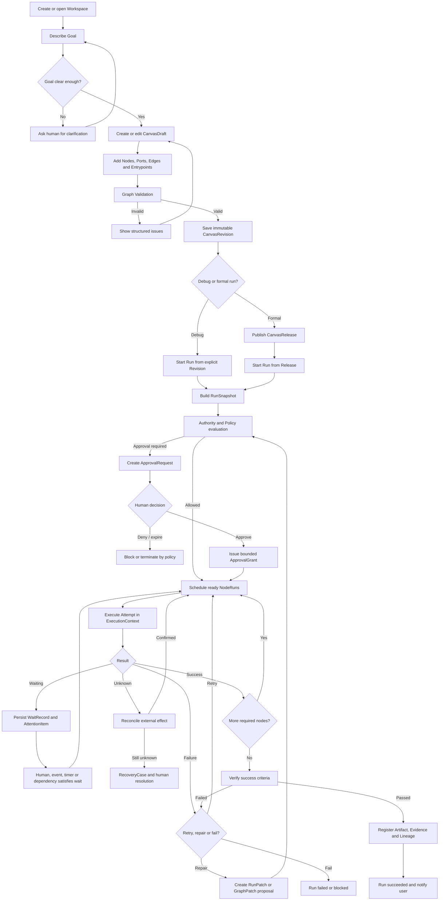

### 4.1 输入框驱动的完整开发任务

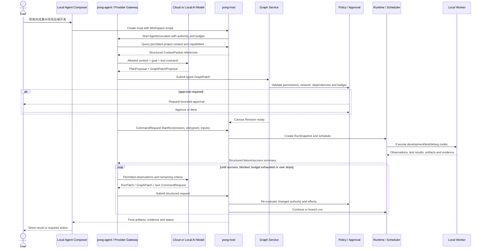

这条链路允许云端 AI 驱动本地任务，但每次动作都由本地 Host 冻结上下文和权限。用户不需要手工点击每个低风险节点；只要 AuthorityProfile 和预算允许，Agent 可以自动循环。权限扩大、工作区外文件、网络、Secret、环境安装、不可逆副作用和成功标准变更必须暂停并请求用户批准。

## 5. 用户操作流程

### 5.1 创建、编辑、发布与运行

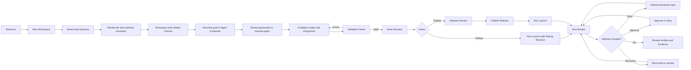

### 5.2 危险删除操作

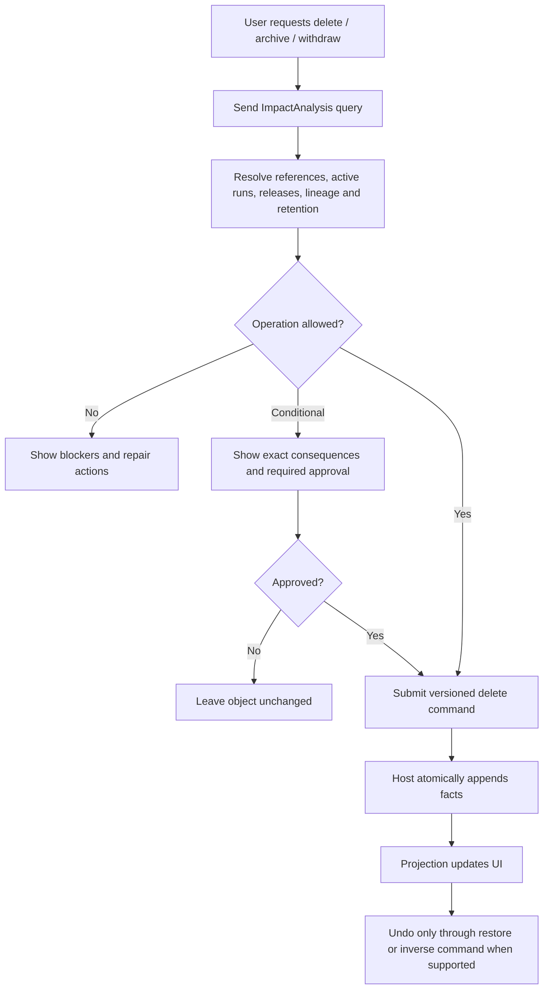

## 6. Query、Command、Event 数据流向

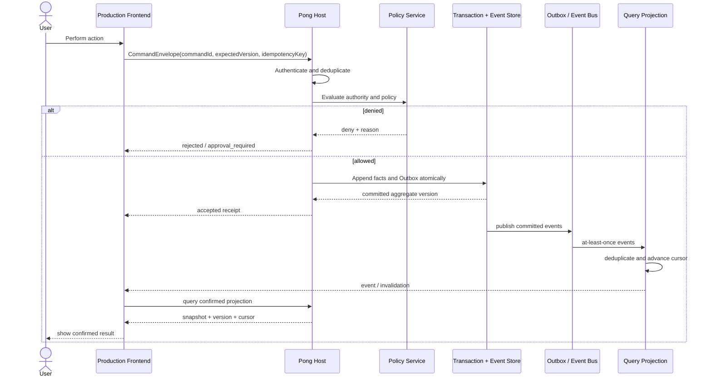

### 6.1 关键数据规则

- `accepted` 不是 `completed`。
- Query Model 是事件投影，不是新的事实源。
- 前端只乐观编辑 Draft，不乐观伪造 Run、Approval 或外部副作用事实。
- Event 至少一次投递；消费者必须用 `eventId` 去重并检查聚合序列缺口。
- 写事实与 Outbox 必须原子提交。
- 断线时前端保留最后确认快照，但必须显示 stale/offline。

## 7. 运行时数据与产物流向

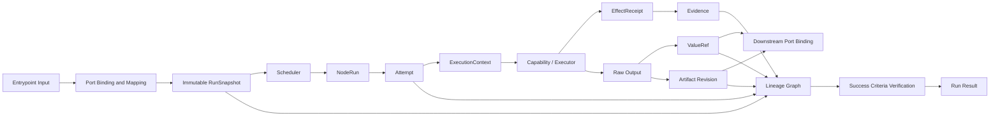

数据传递必须使用类型化 `ValueRef`、`ArtifactRef` 或显式流式通道。节点不得通过隐藏的共享内存、任意临时路径或 UI 状态向下游传值。

## 8. Canvas 编辑、版本和发布流程

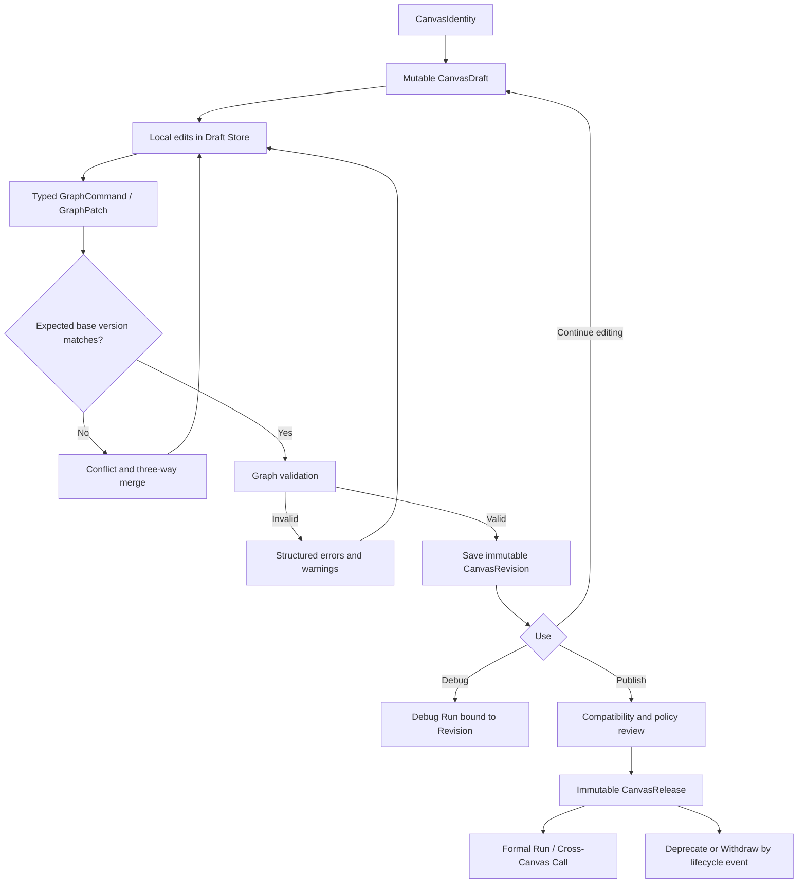

## 9. 权限、审批和授权流程

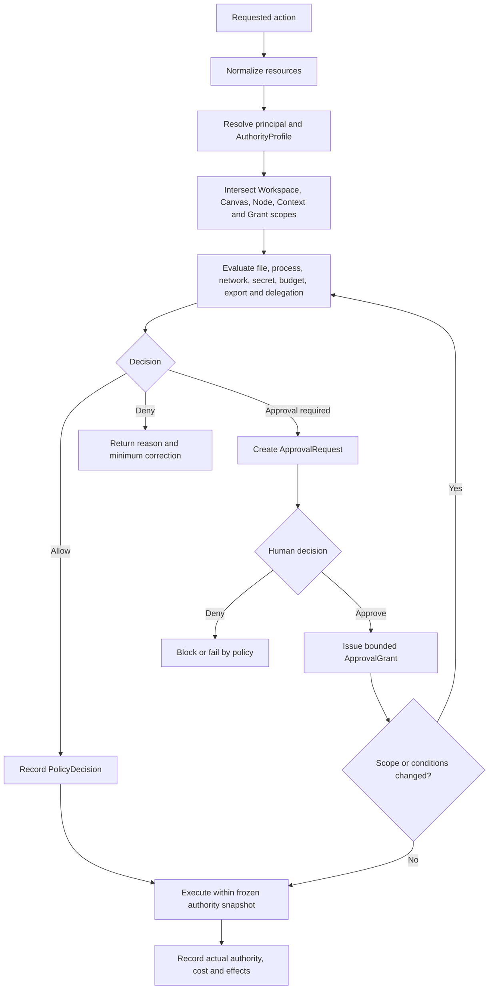

任何 GraphPatch、RunPatch 或 Agent 修复只要扩大文件范围、网络、预算、Secret、执行环境、外部主体、数据敏感度或不可逆副作用，就必须重新进入策略评估，不能继承旧批准。

## 10. 跨 Canvas 调用与投递流程

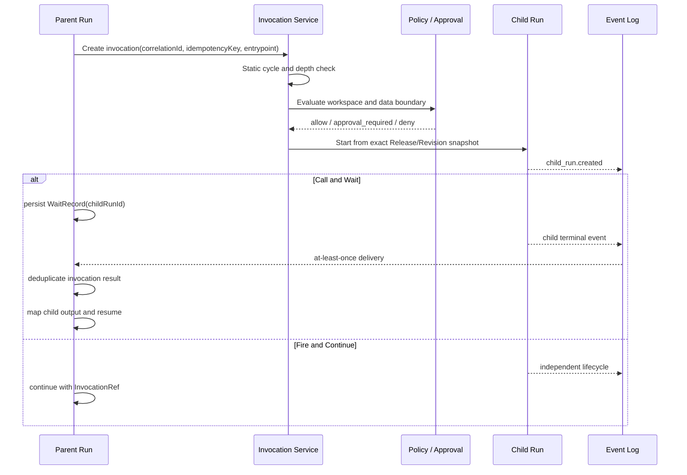

运行时必须维护 `invocationPath`、最大深度、重复调用预算和相关 ID；静态检查不能证明无循环时，运行时仍需阻断动态递归爆炸。

## 11. 取消、结果未知和恢复流程

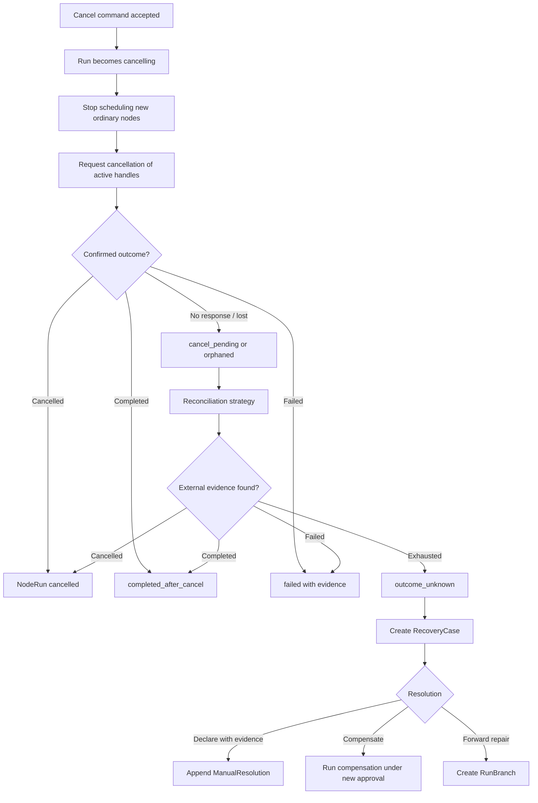

## 12. 正式状态转换图

### 12.1 Canvas 生命周期

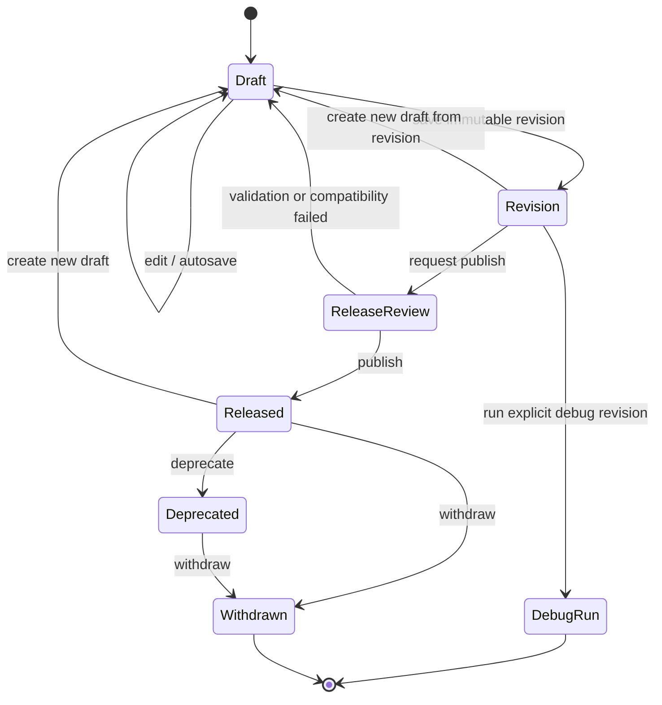

### 12.2 Run 状态

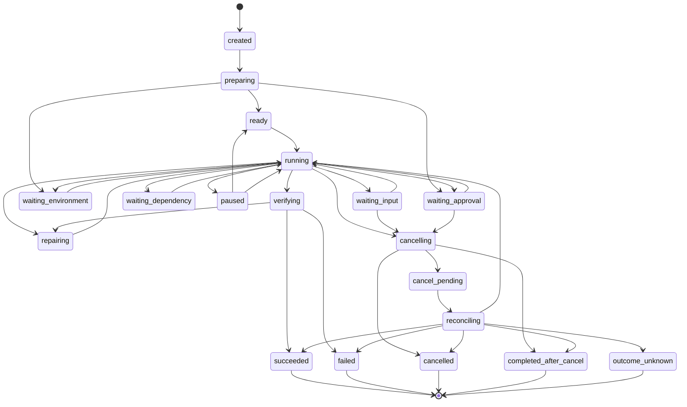

图只展示主要路径；所有直接转移以统一状态合同的合法转移表为准。

### 12.3 NodeRun 与 Attempt 关系

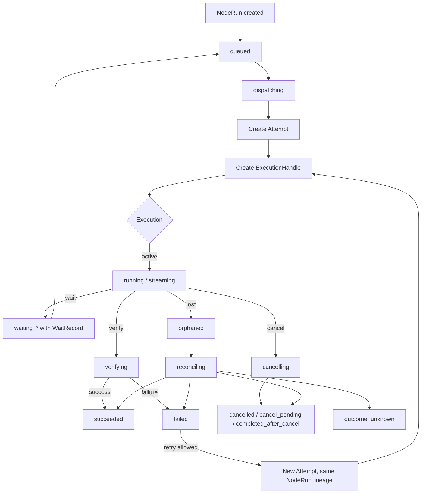

### 12.4 Approval 状态

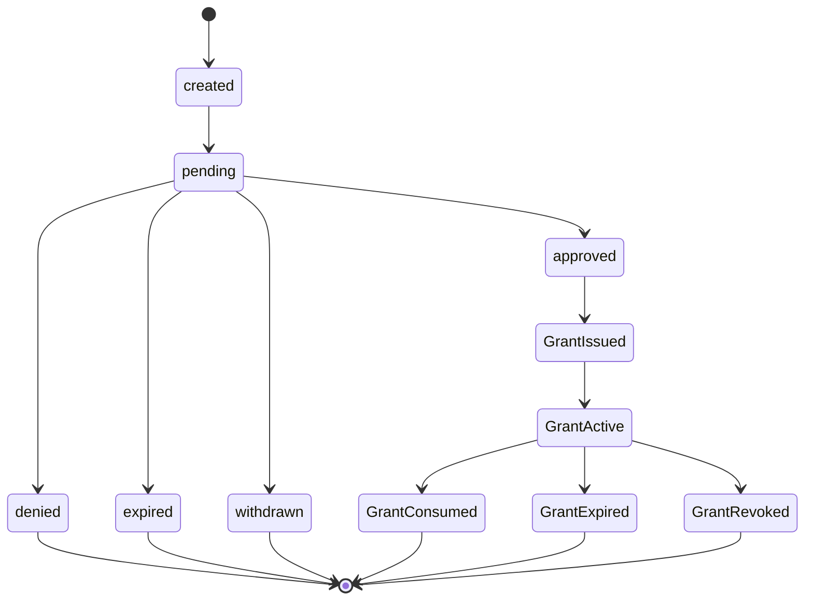

### 12.5 ExecutionContext 状态

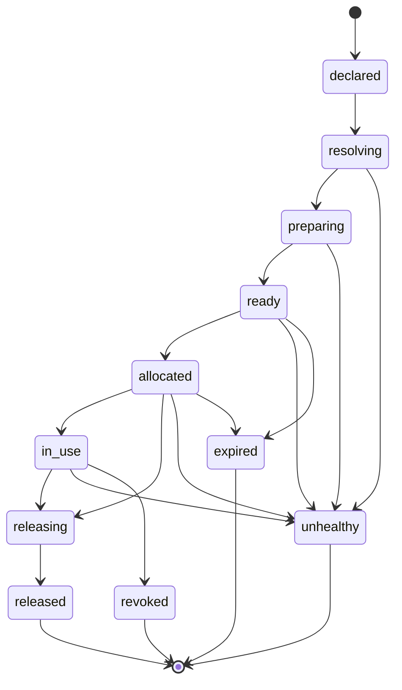

## 13. 前端页面与业务模块映射

| 页面/表面 | 读取投影 | 发出命令 | 订阅事件 | 必须覆盖的异常 |
|---|---|---|---|---|
| Welcome / Recovery | RecentWorkspace、HostHealth、RecoverySummary | Open/Create/RepairWorkspace | Host、Migration、Recovery | Host 不可用、迁移失败、目录无权限 |
| Workspace Overview | WorkspaceSummary、ActiveRun、Attention | Rename、Archive、Backup | Workspace、Run、Policy | stale、只读、损坏、删除阻塞 |
| Canvas Workbench | DraftProjection、Validation、RunSummary | GraphCommand、SaveRevision、StartRun | Draft、Graph、Run、Attention | 冲突、不可运行、权限不足、重同步 |
| Revision / Release | RevisionList、Diff、Compatibility | CreateDraft、Publish、Deprecate、Withdraw | Release、CallerImpact | 不兼容、被调用、审批过期 |
| Run Monitor | Run、NodeRun、Attempt、Log、Artifact | Pause、Resume、Cancel、Retry、Input | Run、Handle、Wait、Recovery | cancel_pending、orphaned、outcome_unknown |
| Attention Center | Wait、Approval、Recovery、Conflict | SubmitInput、DecideApproval、Resolve | Attention lifecycle | 已被其他窗口处理、Grant 失效 |
| Artifact Browser | Artifact、Evidence、Lineage | Export、Deliver、Archive | Artifact、Retention | 敏感数据、引用阻塞、导出审批 |
| Environments | Environment、Context、Health | Prepare、Allocate、Release、Delete | Health、Allocation | 资源不足、失联、权限提升 |
| Extensions | Manifest、Definition、Permission、Health | Install、Enable、Upgrade、Uninstall | Extension、Capability | 签名失败、兼容性、历史依赖 |
| Automations | Schedule、Trigger、Delivery、RunHistory | Create、Enable、RunNow、Disable | Trigger、Run | 重复投递、时区、权限过期 |
| Settings | App/Workspace policy projections | UpdateSettings、Reset | Config changes | 不支持、需要重启、策略禁止 |
| Audit/Event Explorer | AuditEvent、EventEnvelope、Checkpoint | ExportAudit、RebuildProjection | Projection health | 序列缺口、版本不兼容、脱敏 |

## 14. 服务与数据所有权

| 服务 | 拥有的事实 | 接收的命令 | 发出的关键事件 |
|---|---|---|---|
| Workspace Service | Workspace identity、目录绑定、成员、生命周期 | Create/Open/Rename/Archive/Restore | workspace.created/updated/archived |
| Graph Service | Draft、Node、Port、Edge、Entrypoint、Patch | ApplyGraphCommand/GraphPatch、SaveRevision | draft.changed、revision.created、graph.validated |
| Release Service | Release 和兼容性生命周期 | Publish/Deprecate/Withdraw | release.published/deprecated/withdrawn |
| Runtime Service | RunSnapshot、Run、NodeRun、Attempt、Wait | Start/Pause/Resume/Cancel/Retry/SubmitInput | run.*、node_run.*、wait.* |
| Policy Service | PolicyDecision、ApprovalRequest、Grant、Budget usage | Evaluate/Approve/Deny/Revoke | approval.*、grant.*、budget.* |
| Execution Service | ExecutionContext、ExecutionHandle、EffectReceipt | Prepare/Dispatch/Cancel/Reconcile | handle.*、effect.*、context.* |
| Artifact Service | Artifact、Revision、Evidence、ValueRef、Lineage | Register/Verify/Export/Archive | artifact.*、evidence.*、lineage.* |
| Automation Service | Automation、Trigger、DeliveryRecord | Create/Enable/Disable/RunNow/Deliver | trigger.received、delivery.* |
| Extension Service | Extension、Manifest、DefinitionVersion、Capability | Install/Enable/Upgrade/Withdraw | extension.*、definition.* |
| Agent Service | Plan、Proposal、Delegation、Memory/Skill candidates | Plan/Explore/ProposePatch/Delegate | plan.*、proposal.*、delegation.* |
| Recovery Service | RecoveryCase、ReconciliationReport、Resolution | Reconcile/Compensate/Resolve | recovery.*、reconciliation.* |
| Projection Service | 可重建查询模型和 Checkpoint | Rebuild/UpgradeProjection | projection.rebuilt/degraded |

任何两个服务都不能共同拥有同一个可变事实。跨服务信息通过稳定引用、命令和事件传递。

## 15. 关键数据存储分区

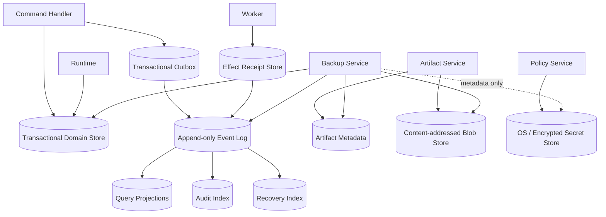

### 15.1 数据分类

| 数据 | 可变性 | 保留要求 | 前端缓存 |
|---|---|---|---|
| Draft | 可变、版本化 | 到放弃或策略清理 | 可缓存编辑副本，必须带版本 |
| Revision/Release/RunSnapshot | 不可变 | 被引用期间不得删除 | 只读缓存 |
| Event/Audit/Evidence | 追加、不可原地修改 | 按审计和活动引用保留 | 分页只读 |
| Projection | 可重建 | 可丢弃重建 | 带 cursor/version 缓存 |
| Artifact Content | 内容寻址 | Retention + 引用保护 | 只缓存授权预览 |
| Secret | 可轮换、明文不可读回 | 吊销后保留元数据审计 | 不缓存明文 |
| View State | 客户端可变 | 用户设置策略 | 可本地持久化 |

## 16. 失败模式与责任模块

| 失败模式 | 首要检测方 | 状态/记录 | 用户入口 | 处理方式 |
|---|---|---|---|---|
| Draft 版本冲突 | Graph Service | conflict + diff | Canvas | 三方合并或放弃 |
| Graph 不可运行 | Validation | ValidationIssue | Validation Panel | 修图、补入口、补权限 |
| 权限不足 | Policy | PolicyDecision deny | Approval/Policy | 收紧任务或申请批准 |
| 环境不可用 | Execution Service | waiting_environment | Run/Environment | 准备、切换或停止 |
| Worker 失联 | Execution Service | orphaned | Recovery Center | 对账，不直接重试 |
| 外部结果未知 | Recovery Service | outcome_unknown | Recovery Center | 人工声明、补偿或前向修复 |
| 事件序列缺口 | Projection | resync_needed | Global Status | Snapshot + replay |
| Artifact 丢失/损坏 | Artifact Service | corruption | Artifact/Diagnostics | 隔离、恢复 Backup |
| Extension 不兼容 | Extension Service | unsupported | Extensions/Migration | 升级、禁用或固定旧版本 |
| Budget 耗尽 | Policy/Budget | waiting_approval/blocked | Attention | 增加预算或终止 |
| Migration 失败 | Migration Service | read_only_recovery | Recovery | 回滚、修复、诊断 |

## 17. 开发拆分顺序

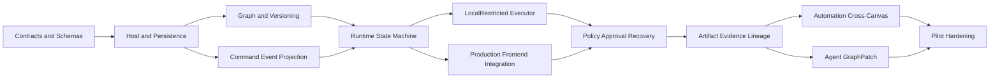

不应先大规模增加标准节点或 Agent 自动修复能力，再补状态、权限、恢复和事件合同。节点数量会放大所有语义不一致。

## 18. 仍需进一步冻结的设计问题

1. 正式产品前端使用 Tauri、纯 Web + 本地 Host，还是双入口；进程边界不变，但构建和更新方案需要决策。
2. Workspace 是单用户本地对象还是未来可同步对象；同步不能改变本地权限边界。
3. Run 日志、流式 Token 和高频进度事件是否进入主 Event Log，或进入可裁剪 Telemetry Stream。
4. 大型 Graph 的分片、子图加载和多人/多 Agent 并发编辑协议。
5. Artifact Blob 的加密密钥、内容去重和跨 Workspace 引用策略。
6. Automation 在应用关闭、Host 停止、系统休眠后的补偿触发语义。
7. Extension UI 是否允许嵌入正式前端；若允许，必须定义进程、DOM、网络和数据隔离。
8. Debug Run 对外部副作用的默认策略，以及 Debug Revision 是否允许被 Automation 调用。
9. 人工 Resolution 的证据等级、双人复核和后续审计更正规则。
10. 云同步、远程 Host 和多设备出现后，Global Position、身份和冲突模型如何扩展。

## 19. 文档完成度与验收

本模型被视为完成，至少需要：

- 每个一级业务域都有唯一负责服务和事实所有者。
- 每个用户操作都能追踪到 Command、Policy、Event、Projection 和 Audit。
- 每个非终态都有恢复来源、截止时间和允许动作。
- 每个外部副作用都有幂等、取消、对账和补偿分类。
- 每个正式前端页面都明确读取投影、发出命令、订阅事件和异常状态。
- 每条关键数据流都能追踪到 Artifact、Evidence、Lineage 或明确的非持久流。
- Mermaid 图与正式合同枚举一致；合同更新时同步修改本文件和测试。
- 交付矩阵中的模块任务、负责人、依赖和阶段出口能映射到本文件章节。
