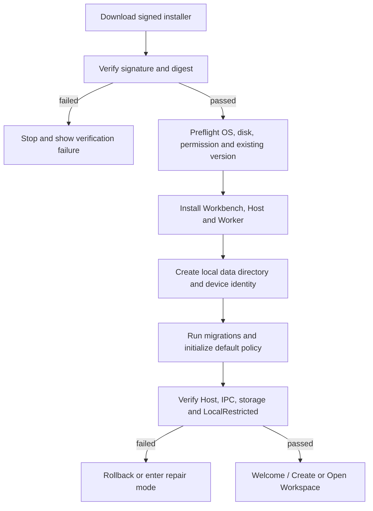
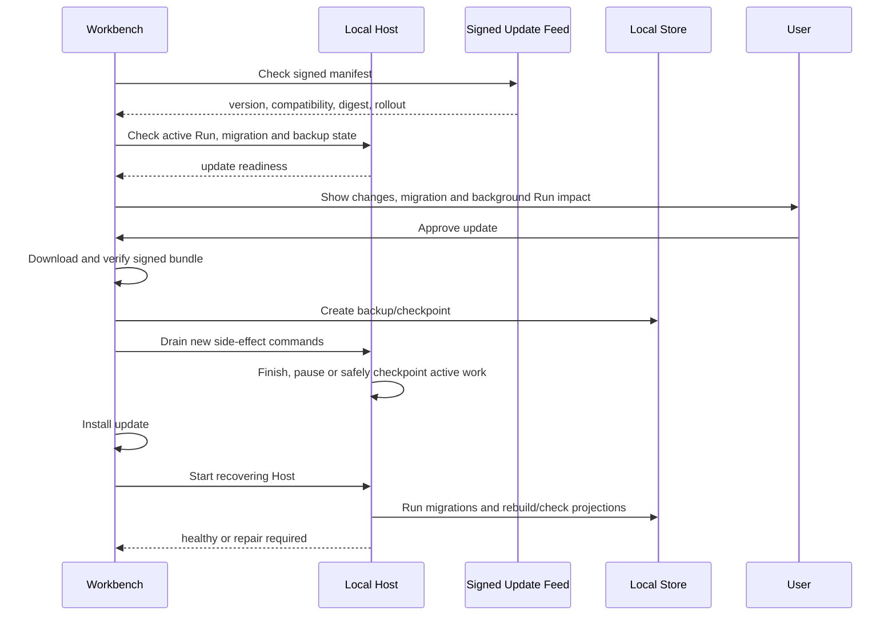
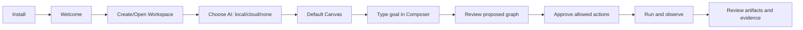

# Seekwd / Pong Harness 分发与用户使用模型

> 文档类型：Distribution / Release / User Operation Model  
> 文档状态：Provisional Contract  
> 最后更新：2026-09-20  
> 适用产品：Seekwd Desktop、Pong Host、LocalRestricted Worker、Extension SDK 和可选云服务  
> 关联文档：[后端与中间件选型](32-backend-and-middleware-selection.md)、[安装升级恢复](24-reference-architecture/11-install-update-recovery.md)、[开放门禁](28-design-review/01-open-gate-matrix.md)

## 1. 分发结论

Seekwd 首版应作为签名桌面应用分发，而不是先做依赖云端的 Web 应用。

```text
Seekwd Installer
  -> Workbench UI
  -> Pong Host
  -> LocalRestricted Worker
  -> Built-in Node Definitions
  -> Local migrations / initial policies

Optional services
  -> Account / Entitlement
  -> Update Manifest
  -> Extension Catalog
  -> Opt-in Sync / Encrypted Backup
```

### 1.1 推荐分发渠道

| 渠道 | 首版策略 | 适用用户 | 说明 |
|---|---|---|---|
| 官方下载页 | 首要渠道 | 普通用户、开发者、试点用户 | 提供平台、版本、变更说明、签名信息和校验摘要 |
| GitHub Releases 或等价 Release Registry | 工程分发和 Beta | 开发者、内部测试 | 只发布已签名、可追溯构建产物 |
| Windows 包管理器 | 第二阶段 | 技术用户和企业设备 | winget/企业软件分发，仍使用同一签名产物 |
| Microsoft Store | 暂不作为首版硬依赖 | 普通 Windows 用户 | 需要额外审核、更新和文件访问策略，后续评估 |
| macOS DMG/PKG | macOS 版本阶段 | macOS 用户 | Developer ID 签名和 notarization |
| Linux AppImage/deb/rpm | 后续 | Linux 用户 | 先提供 AppImage；系统服务和沙箱按平台单独验收 |
| 云端 Web | 不作为首版主产品 | 仅公共目录/管理页面 | 不承载完整本地 Canvas/Run 执行体验 |

### 1.2 安装包边界

安装包必须包含：

- `apps/workbench` 正式前端。
- `pong-host` 及其依赖的 Core、Runtime、Policy、Artifact 和 Extension Service。
- 首个 `LocalRestricted` Worker/Executor。
- 内置标准节点、协议 Schema 和初始迁移。
- 签名的版本 Manifest、兼容范围和默认安全策略。

安装包不得包含：

- 用户的 Workspace 文件。
- 用户 Secret 明文。
- 预置的全权 AuthorityProfile。
- 未验证或未签名的 Extension。
- 会自动上传用户数据的后台服务。

### 1.3 平台包型选择

| 平台 | 首选包型 | 安装范围 | Host 方式 | 后续渠道 |
|---|---|---|---|---|
| Windows 10/11 x64 | Tauri NSIS 签名 `.exe` | 默认 per-user、无需管理员 | 应用按需启动用户级 Host；后台运行需用户开启 | winget；企业另提供 MSI/离线包 |
| Windows ARM64 | 合同稳定后原生构建 | per-user | 同 x64 | winget/企业分发 |
| macOS Apple Silicon/Intel | 签名并 notarize 的 DMG/PKG | 用户 Applications | LaunchAgent 仅在用户开启后台任务时使用 | Sparkle/Tauri Update 或签名 Feed |
| Linux | AppImage 首发，后续 deb/rpm | 用户空间优先 | 用户级进程/systemd user 可选 | 签名仓库/Release Registry |

Stable 不推荐提供“解压即用的便携版”作为主要渠道，因为设备身份、OS Secret Store、更新、Host 租约和恢复目录需要稳定安装身份。可为开发和故障诊断提供受限 Portable Build，但必须使用独立数据目录并禁用自动迁移真实用户数据。

### 1.4 独立内容包分发

| 包类型 | 建议扩展名/载体 | 内容 | 安装规则 |
|---|---|---|---|
| Extension Bundle | `.seekwd-extension` 或签名目录包 | Manifest、Definition、执行代码、Schema、权限和合同测试声明 | 先隔离校验、权限预览、兼容检查，再安装 |
| Canvas Package | `.seekwd-canvas` | Canvas Revision、Entrypoint、依赖、Template 元数据 | 导入为 Draft，不自动运行 |
| Encrypted Backup | `.seekwd-backup` | 数据快照、事件、Artifact 选择集和恢复 Manifest | 恢复前预检、解密、验证和冲突分析 |
| Diagnostic Bundle | `.seekwd-support` | 脱敏日志、事件摘要、版本和健康信息 | 用户预览后导出，不自动上传 |

具体扩展名在协议冻结时确认，但包内必须有版本 Manifest、Digest、签名/完整性、依赖和数据分类，不能只是未定义 ZIP。

### 1.5 Host 与 Worker 随应用交付

Windows 首版将 `pong-host.exe` 和 `pong-worker.exe` 作为签名 sidecar/伴随二进制包含在 Tauri 安装包中：

1. Workbench 启动时通过用户级租约检测已有 Host。
2. 已有健康 Host 时连接，不重复启动。
3. 没有 Host 时启动安装包内匹配版本的 `pong-host`。
4. Host 按需创建 Worker；Worker 不接受来自 Workbench 的直接连接。
5. 关闭窗口时，根据 Background Execution Policy 决定 Host 继续运行、进入 draining 或停止。
6. 只有启用了 Automation/Background Run 的用户才允许配置登录后启动；默认不注册系统级常驻服务。
7. 更新必须把 Workbench、Host、Worker 和协议兼容范围作为同一 Release Manifest 验证，不能单独替换一个二进制而不检查兼容性。

## 2. 版本与构建分发

### 2.1 Release Channels

```text
nightly   -> 内部开发，允许破坏性变化，不面向普通用户
beta      -> 受邀试点，具备迁移和回滚说明
stable    -> 普通用户，必须通过开放门禁
enterprise -> 企业验证版，可固定版本和离线安装
```

用户默认进入 `stable`。切换到 `beta` 或 `nightly` 必须显示数据迁移、Extension 兼容、回滚限制和支持范围。

### 2.2 构建产物

每个平台的 Release 必须同时生成：

| 产物 | 用途 |
|---|---|
| 安装包 | 用户安装和升级 |
| Update Bundle | 自动更新 |
| SHA-256/BLAKE3 摘要 | 下载完整性校验 |
| 签名和证书链 | 平台和应用完整性验证 |
| SBOM | 依赖与供应链审计 |
| Release Manifest | 应用、Host、协议、数据库和 Extension 兼容范围 |
| 变更说明 | 用户可读的功能、修复、限制和迁移提醒 |
| 回滚说明 | 代码、Schema、数据和活动 Run 的兼容边界 |

构建必须关联 commit、协议版本、Schema 版本、数据库迁移版本和构建时间。不能只使用一个应用版本号代表全部兼容性。

### 2.3 签名与供应链

- Windows 使用受信任的代码签名证书；企业版可附加 MSIX/软件分发签名。
- macOS 使用 Developer ID 签名并 notarize；Gatekeeper 拒绝未签名或篡改包。
- Linux 包提供签名仓库或可验证摘要；AppImage 必须提供签名信息。
- Update Manifest 必须签名，应用内置公钥或可信根，不能从下载内容中取得验证公钥。
- Extension 与 NodeDefinition 使用独立签名/完整性校验，不因应用签名而自动可信。
- CI 生成 SBOM、依赖漏洞报告和构建 provenance；高风险依赖不允许静默进入 stable。

## 3. 安装、首次启动和卸载



首次启动必须向用户说明：

1. 应用默认本地运行。
2. 不登录云端也可以使用核心功能。
3. Workspace 目录、应用数据目录和云同步范围不同。
4. LocalRestricted 的文件、网络、进程和资源限制。
5. 云端 AI Provider 是否启用、会发送哪些数据和如何关闭。
6. 后台 Run、关闭窗口、锁屏和系统休眠的行为。

卸载前必须显示：

- 本地应用数据是否保留。
- Workspace 文件不会因卸载自动删除。
- 本地 Artifact、Run 历史、Backup 和 Secret 引用是否保留。
- 云端副本是否独立存在。
- 活动 Run 和 RecoveryCase 的处理方式。

## 4. 其他用户的使用模式

### 4.1 Local-only User

适合不希望上传数据或没有网络的用户：

```text
安装应用
  -> 不登录
  -> 选择本地 Workspace
  -> 使用本地/自部署 AI Provider 或手动建图
  -> LocalRestricted 执行
  -> 本地保存 Run、Artifact 和审计
```

该模式必须可完成完整的本地参考生命周期。云端账户不是使用许可的默认前提。

### 4.2 Cloud AI User

用户可以连接云端模型 Provider，但云端模型只通过本地 Agent Gateway 工作：

```text
Prompt in Composer
  -> local Context filtering
  -> cloud model inference
  -> structured Plan/Patch/CommandRequest
  -> local validation, policy and approval
  -> local Run/Worker
```

用户在 Provider 页面看到：发送的数据类别、Workspace 范围、模型、成本、保留策略、是否训练、失败行为和禁用入口。

### 4.3 Sync/Backup User

用户开启云同步或加密备份后：

- 本地仍是运行权威。
- 云端只收到已授权数据类别。
- 同步失败不阻止本地操作。
- 不可变 Revision/Release 可按 Digest 同步。
- Draft 冲突必须明确显示并合并。
- Secret、ExecutionHandle、ApprovalGrant 不跨设备复用。

### 4.4 Team / Enterprise User

团队版不应直接把个人桌面应用改成共享数据库。推荐增加：

```text
Team Cloud
  Account / Organization / Membership
  Shared Catalog / Template / Release
  Encrypted Artifact / Backup
  Audit and Entitlement

Local Device
  Local Workspace / Host / Worker / Secrets / Run
```

首期团队能力优先做：共享模板、发布版本、加密 Artifact 交付、审计和设备管理；实时多人编辑、云端调度和远程 Worker 后置。

### 4.5 Extension Developer

扩展开发者可以：

1. 安装 SDK 和本地开发工具。
2. 在隔离开发环境加载未签名 Extension。
3. 使用合同测试验证 Manifest、权限、输入输出、取消和副作用。
4. 构建签名包并提交 Catalog 或团队私有 Registry。
5. 用户安装前查看权限、来源、版本和兼容性。

未签名扩展不能进入普通用户的 stable 安装流程。

## 5. 更新策略

### 5.1 更新流程



### 5.2 更新规则

- 普通更新不得静默取消活动 Run。
- 更新前必须检查活动 Run、未提交 Draft、RecoveryCase、磁盘空间和备份。
- 数据库迁移与应用回滚分开处理；代码回滚不保证数据回滚。
- 不兼容时进入只读或修复模式，不继续接收高风险命令。
- Extension 更新不能在活动 Run 中悄悄替换 NodeDefinition。
- 自动更新默认只检查和提示；高风险迁移需要用户确认。
- Stable 使用分批发布、暂停开关和快速撤回 Manifest。

## 6. 其他用户如何开始使用

### 6.1 五分钟首次使用路径



### 6.2 用户需要理解的三个对象

| 对象 | 用户理解 | 系统事实 |
|---|---|---|
| Workspace | 一个项目和本地目录边界 | 文件、权限、环境、Canvas 和策略范围 |
| Canvas | 一套可重复运行的流程图 | Draft、Revision、Release、Entrypoint 和节点 |
| Run | 某个版本的一次执行 | 固定 Snapshot、NodeRun、Attempt、Artifact 和 Evidence |

### 6.3 用户不应被迫理解的内部细节

普通用户不需要先理解 SQLite、Event Log、Outbox、Worker PID 或 Cursor。但在发生错误、审批、恢复、冲突和云同步时，界面必须用可理解的方式解释：

- 当前发生了什么。
- 哪个对象受影响。
- 是否已经产生外部副作用。
- 现在能否继续、暂停、重试或取消。
- 是否需要用户授权。
- 数据是否离开本机。

## 7. 分发后的支持和诊断

- Help/Diagnostics 页面显示 Workbench、Host、协议、Schema、数据库和 Extension 版本。
- Support Bundle 默认只导出脱敏信息、事件摘要、错误码和最小引用。
- 用户可以复制稳定的 Workspace/Canvas/Run/Artifact ID，而不是复制本地 Secret 或完整路径。
- Bug 报告必须支持从 Notification、Run、RecoveryCase 和 Audit 直接打开诊断上下文。
- 云端故障、更新失败、Extension 崩溃和 LocalRestricted 拒绝必须有不同处理入口。

## 8. 分发验收门槛

1. 新机器可在没有 Node.js、Rust、Docker 或数据库服务的情况下安装并启动稳定版。
2. 安装包、更新包、Extension 包均能验证签名和摘要。
3. 首次启动自动初始化 Host、SQLite、迁移、IPC 和默认安全策略。
4. 升级前备份、活动 Run 处理、迁移、健康检查和修复模式可演练。
5. 卸载不会误删用户 Workspace 文件或 Secret 明文。
6. 无账户、断网和云端完全不可用时，本地参考生命周期仍能完成。
7. 云端 AI Provider 断开时，用户可以切换本地模型、手动建图或暂停任务。
8. 普通用户不能安装未签名或权限声明不完整的 Extension。
9. 企业用户可以固定版本、离线安装、禁用云同步和集中管理更新。
10. 版本回滚、数据库恢复、Projection 重建和活动 Run 对账有故障测试证据。
